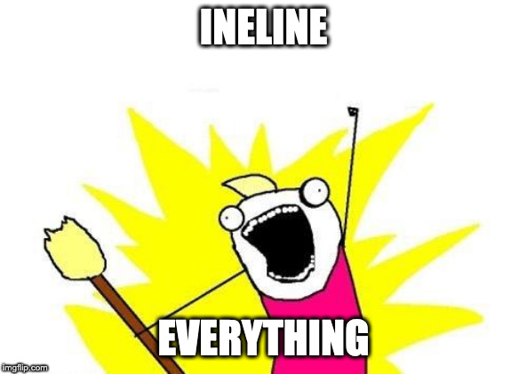

# Inline everything

Recently heard some Android dev said "inline functions ruins all the stack trace!!!". But for some 
reason I never recall anytime which it is an issue for me, both in terms of personal project, or
my day job. So I'd like to see if it's cause by how they configure their project, or is it a general
issue for everyone.

## Findings

- Yes, the stack trace now contains line number that is outside the length of the file
- But if you are using Android Studio, it does a very good job in the Logcat to highlight what is
  the actual call-site
- And for external crashes, "Analyses Stack Trace" also works pretty god damn well
- That probably explains why I never saw that as an issue.

## IMO

- Inline function has no impact for debug builds
- Inline function has some but often neglectable impact or devX
- Just like every other kotlin feature, don't over-use it in places where it doesn't make sense
